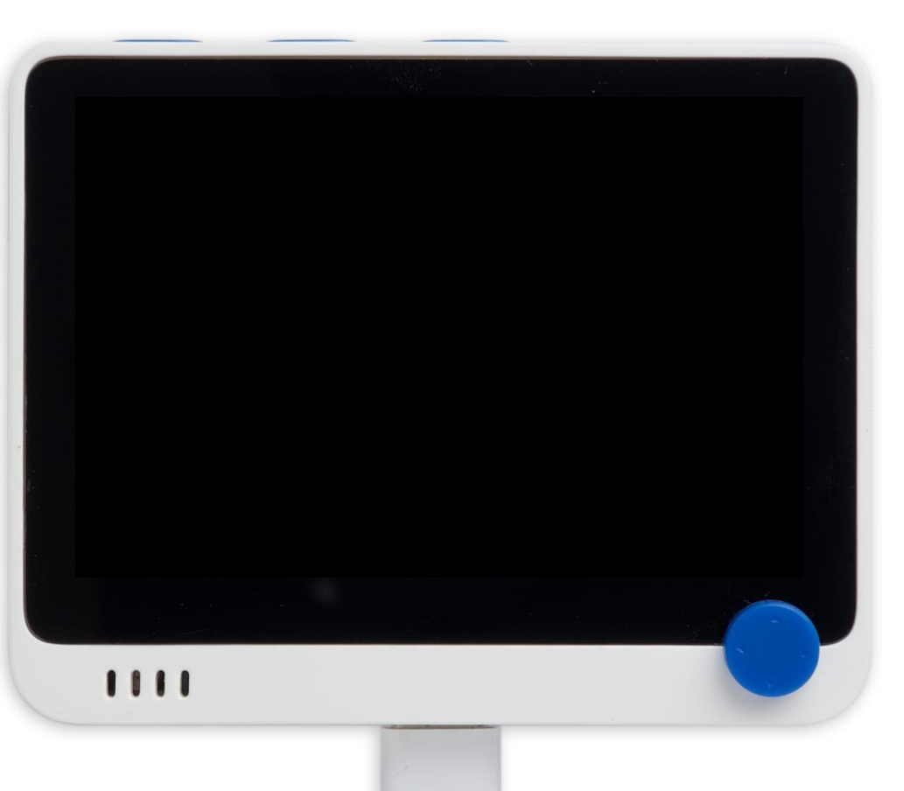

# wiointerface

Wiointerface is library for developing and tinygo software for wio terminal.
This is private **"under development release"** for making applications using this library. There will be interface compatility breaks at future

Idea of this library is to allow compile microcontroller software on tinygo and test/demo version for pc 

On PC libsdl interface 
ls*A*,*S* and *D* keys are 3 keys on top of wio terminal. Arrow keys match to arrow pad on wio and return key is "press joystic down" button

# Demo programs

Demo programs under cmd directory are compiled with command
~~~sh
tinygo build -target=wioterminal -o out.uf2
~~~

I personally use script to 
~~~sh
mkdir -p mountti
mount /dev/sda ./mountti/
tinygo build -target=wioterminal -o ulos.uf2
cp ulos.uf2 ./mountti
umount ./mountti
~~~

Building demo on PC is just
~~~sh
go build
~~~

# Test programs
- ambient just shows how to use BME280 on wio terminal (left side I2C connector)
- chip8 is just chip8 emulator
- marijodemo just drawing some scrolling sprites